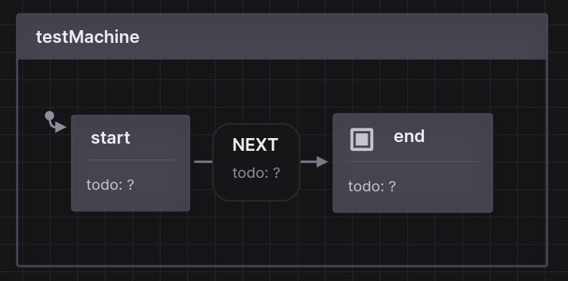

XPlay

This repo stores a very basic boilerplate code for the model-based testing with XState and Playwright.



```code
npm install
npx playwright test ./tests/helloPage.test.js
```

## Notes:
1. 'Test Machine' describes transitions and store links to state asserts described in ...
```js
const testMachine = createMachine({
  id: 'testMachine',
  predictableActionArguments: true,
  initial: 'start',
  context: {
    testContext: 'sampleTestContext'
  },
  states: {
    "start": {
      description: "todo: ?",
      meta: states.start.meta,
      on: {
        "NEXT": {
          description: "todo: ?",
          target: "end"
        }
      }
    },
    "end": {
      description: "todo: ?",
      type: "final"
    }
  }
})
``` 
2. ... 'states'.
```js
const states = {
  start: {
    meta: {
      test: async (page, params) => {

        await page.goto('https://www.google.com');
        const title = await page.title();
        await expect(title).toContain('Google');

      }
    }
  }
}
```